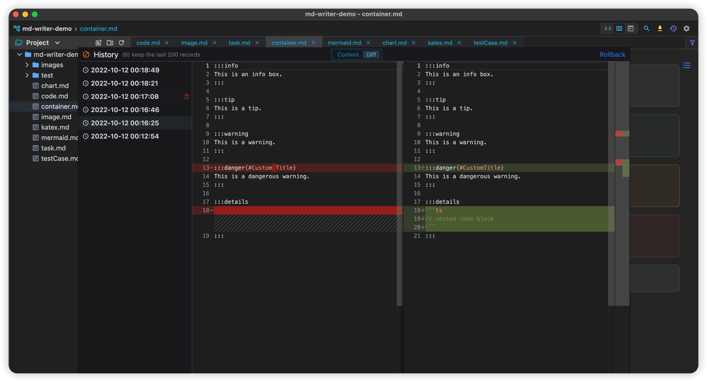
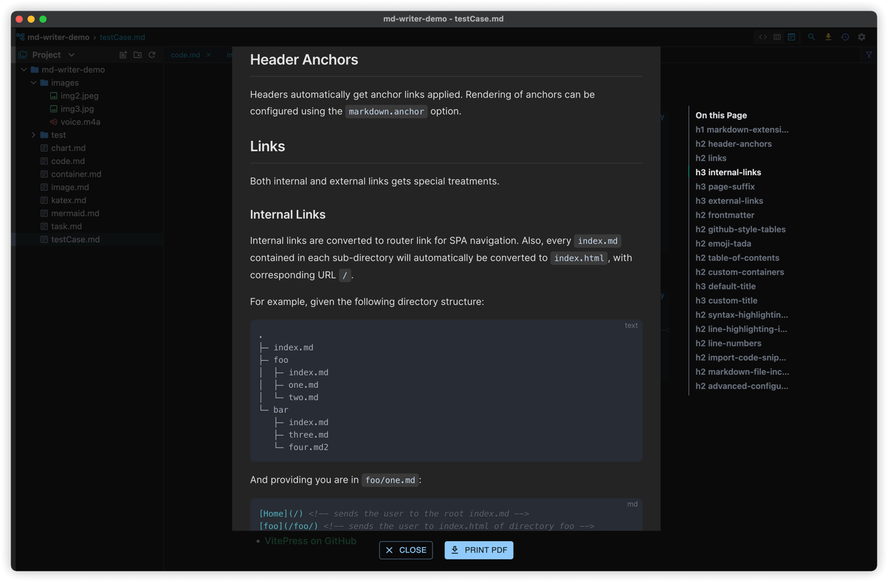

# Markdown Writer
A simple markdown technical note **[Download](https://github.com/1943time/markdown-writer/releases)**

English | [简体中文](README.zh-CN.md)

## Introduction
- Using [monaco-editor](https://microsoft.github.io) as the editor, some enhancements have been made on this basis, such as: path completion, link jumping, list indentation, table formatting, etc.
- The renderer uses the [vitepress](https://github.com/vuejs/vitepress) style

## Functions
- Gfm syntax support
- print pdf
- heading map
- emoji
- Advanced Search and File lookup
- Free adjustment of file tree
- History and rollback
- The clipboard file is copied directly to the editor

## Screenshot

