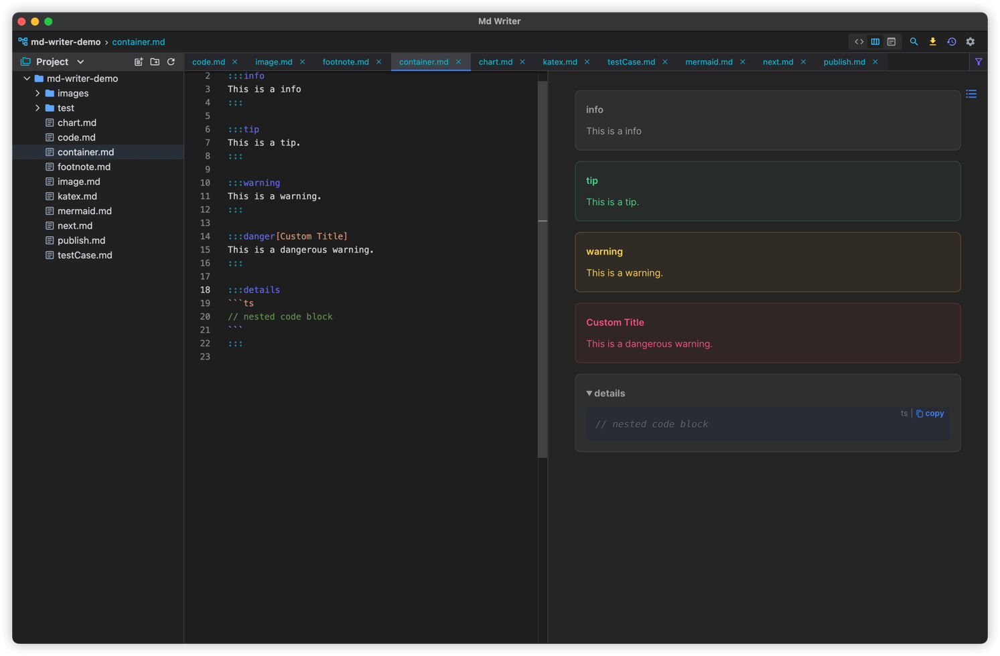

# Markdown Writer
A simple markdown technical note **[Download](https://github.com/1943time/markdown-writer/releases)**

**⚠️ Mac os not signed yet**

English | [简体中文](README.zh-CN.md)


## Introduction
- Using [monaco-editor](https://microsoft.github.io) as the editor, some enhancements have been made on this basis, such as: code completion, link jumping, list indentation, table formatting, etc.
- The renderer uses the [vitepress](https://github.com/vuejs/vitepress) style

## Functions
- Gfm syntax support
- print pdf
- heading map
- [Footnote](https://github.blog/changelog/2021-09-30-footnotes-now-supported-in-markdown-fields/)
- emoji
- synchronous scrolling
- [custom containers](#containers)
- [katex and code completion](#katex)
- [mermaid diagrams](#mermaid)   Related Links [github](https://github.com/mermaid-js/mermaid)
- Advanced Search and File lookup
- Free adjustment of file tree
- History and rollback
- The clipboard file is copied directly to the editor

## Mac can't open app
> Very sorry that in the early stages of the project, the mac code signing has not been done  
> The solution is as follows

step1
```shell
sudo spctl  --master-disable
```
step2
```shell
sudo xattr -r -d com.apple.quarantine /Applications/Md\ Writer.app
```

## Screenshot


### katex

### containers

## mermaid
use .shape suffix to render

```


