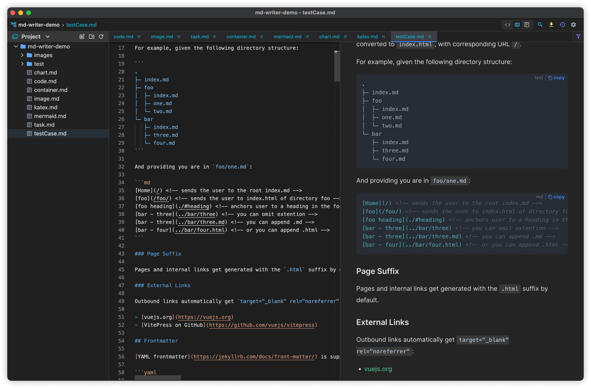
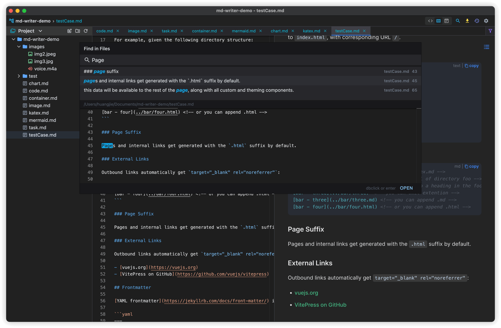
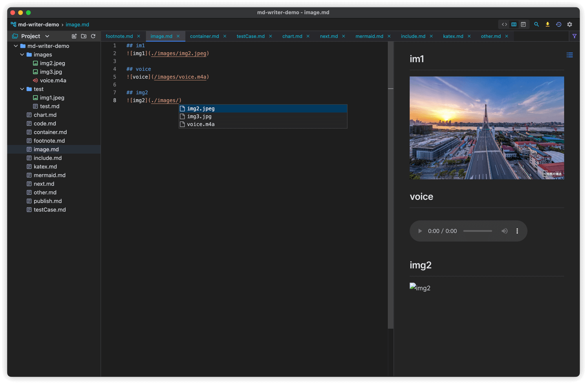

# Markdown Writer
一款简单的markdown技术笔记  **[下载](https://github.com/1943time/markdown-writer/releases)**

English | [简体中文](README.zh-CN.md)



## 介绍
- 使用[monaco-editor](https://microsoft.github.io)作为编辑器，在此基础上做了一定增强，例如：代码补全，链接跳转，列表缩进，表格格式化等
- 渲染器使用了[vitepress](https://github.com/vuejs/vitepress)的风格

## 功能
- Gfm 语法支持
- pdf 导出
- 标题导航
- 表情
- 高级搜索与文件查找
- 自由调整文件树
- 历史记录与回滚
- 剪贴板文件直接拷贝入编辑器中

## Mac 系统无法打开
> 非常抱歉在项目的早期阶段，还没有进行mac 代码签名  
> 解决方法如下

step1
```shell
sudo spctl  --master-disable
```
step2
```shell
sudo xattr -r -d com.apple.quarantine /Applications/Md\ Writer.app
```
## 截图




